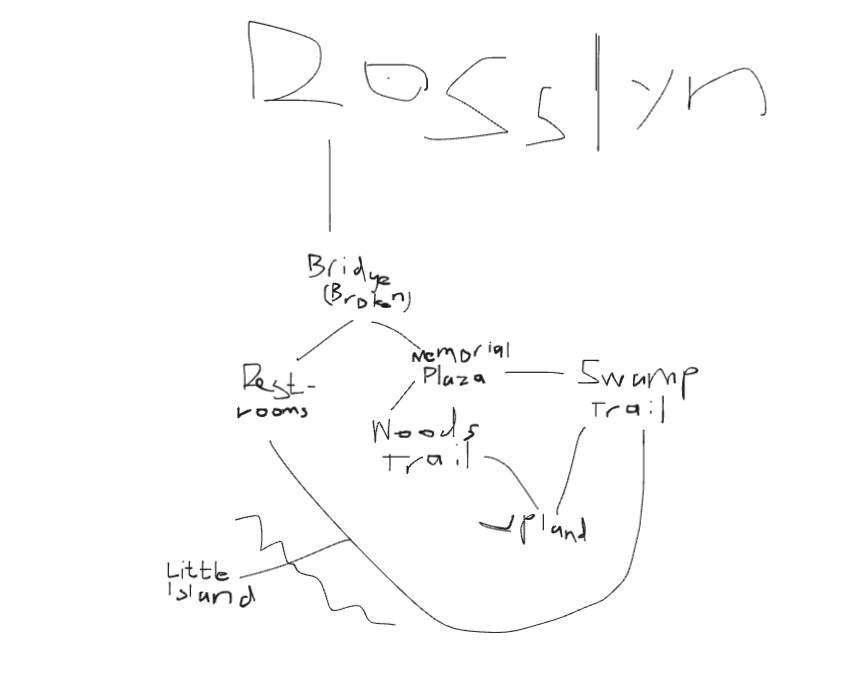

My game title is Stuck on Roosevelt Island. 
Image:

Setting:
Roosevelt Island is a real island near Rosslyn. It was made to honor the 26th U.S. president Theodore Roosevelt, who loved nature. It has 3 trails, Woods, Upland, and Swamp. It also has a memorial plaza, restrooms, and a little island within swimming distance. There is a bridge connecting the island to Rosslyn. I tried to make it as realistic as possible.
Story:
After a major accident, the bridge is destroyed. Your job is to find a way to reconstruct the bridge and leave before 30 days is up. You must collect 100 wood planks to rebuild the bridge. Each action is counted, and you can do up to 5 actions a day. While you are looking for wood, you should also collect water, because if you don't drink in a 3 day period, the game ends. Note to users: When you wake up, press the enter key. It's like an action, but it doesn't count.

Global Variables:
There are a ton of global variables, but the most important ones are actions, day, water, wood, and hasAxe. Actions, day, water and wood are numbers. Actions track the amount of actions taken, resetting every day, day counts the amount of days, water tracks the amount of water the user has, which decreases by one every night to simulate hydration (note to players: you can only collect water at the broken bridge, the restrooms (don't worry not the toilet water), and the swamp trail), and wood is the amount of planks the user has, with one tree being 4 planks. hasAxe is a boolean that tracks if the player has the axe, so the player can cut wood.

Other variables include the daysWithoutWater and the trees(place) vars (i.e. treesPlaza, treesRestrooms, etc.). daysWithoutWater is a number that tracks the amount of days a player has gone without nighttime hydration. If that number is 3 or over, the game ends. trees(place) vars keep track of the amount of trees at a certain place, and when a player cuts one down, the value will go down with it. Each location has 5 trees.
